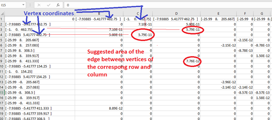

This project is an implementation of 3d version of **Truss Layout Optimization** algorithm.
The 2d version can be found here:
https://link.springer.com/article/10.1007/s00158-019-02226-6

The most simple way to install the necessary libraries is to install miniconda and make an environment from environment.yml.
After installing miniconda https://docs.conda.io/en/latest/miniconda.html, open a terminal and type:

C:\ProgramData\Miniconda3\Scripts\activate.bat C:\ProgramData\Miniconda3
conda env create -f D:\Truss\python_projects\environment.yml

_*"C:\ProgramData\Miniconda3" - path to your conda installation.
*"D:\Truss\python_projects" - path to the folder where you downloaded this project to._

The above steps need to be performed only ones per computer.

After that, you can run the project.
The entry point of the project is main_full_example.py.
The command line options are:

**--nas_file_path**
Path to the input nastran file. There is on example file in the input folder of the repository.

**--csv_file_path**
Path to the output csv files. The csv file format is: 

**--mp4_file_path**
Path to animation files

**--graph_png_file_path**
Path to convergency graph picture

The only "must" parameter is "--nas_file_path".

**How to run the project from terminal**:

C:\ProgramData\Miniconda3\Scripts\activate.bat C:\ProgramData\Miniconda3
conda activate TrussTopologyOptimization

cd "D:\Truss\python_projects\algo_proj"

set PYTHONPATH=%PYTHONPATH%;D:\Truss\python_projects\common_utils_proj;D:\Truss\python_projects\math_utils_proj;D:\Truss\python_projects\vis_utils_proj

python main_full_example.py --nas_file_path D:\Truss\python_projects\input\nastran\wind_upendra_1.nas --csv_file_path D:\Truss\python_projects\output\wind_upendra_1\upendra.csv --mp4_file_path D:\Truss\python_projects\output\wind_upendra_1\upendra.mp4 --graph_png_file_path D:\Truss\python_projects\output\wind_upendra_1\upendra_graph.png

**How to debug the project in pycharm:**

Make a project for "algo_proj" directory.

File->New Project
In the "Location" field choose the path to the algo_proj directory.

Select "Previously configured interpreter" and choose as the created TrussTopologyOptimization.
Then open File->Settings, select Project->Project Structure.

Add a content roots common_utils_proj, math_utils_proj, vis_utils_proj.

Select Run->Edit Configurations...

Add new configuration.

In the "Script Path" choose the path to algo_proj\main_full_example.py.

In the Parameters type the input parameters, at least --nas_file_path.

Then Run->Debug and choose the new configuration.

